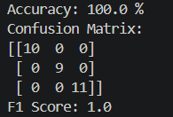

---

## Iris Classification README

```md
# Iris Flower Classification Using KNN

## Description

A machine learning project that classifies Iris flowers using the KNN algorithm.

## Output Screenshot



## Features

- Iris Dataset
- StandardScaler
- Train-Test Split
- KNN Classification
- Accuracy Score
- Confusion Matrix
- F1 Score

## How to Run

```bash
pip install -r requirements.txt
python iris_classifier.py
